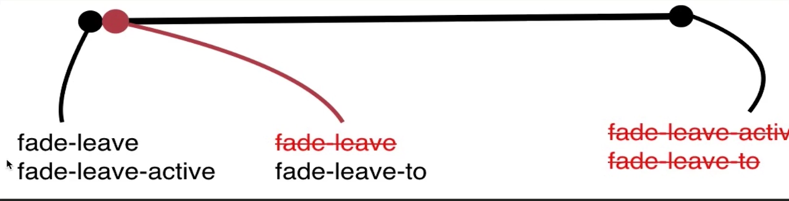

### 项目简介
  去哪网，学习中，以后持续补充...


### 1、vue的简介
vue是mvvm 的框架 , m是model,v是view，vm 是vue内置的层。
  jq 更多的是操作dom。而vue是更多的操作数据,数据和页面之间的联动(VM)，就是vue实现的。

### 2、父子组件关系
 html的层级关系就是父和子组件的关系。

### 3、$emit 子 --> 父 传递事件
注册一个组件和使用该组件时，把这个组件的方法，都写到注册组件里面。
   同时，若往父组件传递事件（在注册组件中写this.$emit）时，这个实例组件应该去监听父组件的事件。

### 4、ol ul标签区别
```
<ol></ol>默认前边是 '1,2' 排序的数字; <ul></ul> 默认前边是 '.'
```
 

### 5、打印 vm
想看（var vm = ）new Vue() 出来的实例的属性和方法，可以去控制台打印vm；

### 6、methods、computed、watch比较
  methods 不做缓存,不管数据有没有变化,都会调用里面的函数;
  computed 会做缓存，只有在数据变化的时候，才会计算return出来的数据，若不变化，则执行之前缓存的数据，性能更高;
  watch 会做缓存，监听数据的变化，但是实现相同的功能,比computed代码多，没有computed简洁。

### 7、computed 中的 get、set
computed 里面的get和set方法， 若data中的数据发生变化，会通过set把变化的结果返回出来，再通过get计算后，显示到页面；若数据没有变化，只执行get方法，不会执行set函数。

### 8、{{}} 里面可以调函数
插值表达式，{{}}，里面可以调函数，例如: {{fullName()}}

### 9、样式切换No.1
class的对象绑定 ： :class = '{activated: isActived}' ，class = activated，是否显示，取决于 isActived是true 还是false

### 10、样式切换No.2
class可以绑定一个数组，即 :class = '[activated]',通过在data中定义activated，并且在methods中控制 activated 是 ' '和 activated(css中写该样式) 来改变样式。

### 11、样式切换No.3
也可以直接用style来改样式，即 :style = '[],{}',设置数组，对象都可以。

### 12、v-if、v-show 比较
v-if 和 v-show 都可以控制标签的显示和隐藏，但v-if ='false'时会销毁该元素，v-show='false'时，只是display：none了该元素而已。相对来说，频繁切换时，v-show的性能要比v-if 的性能高一些。

### 13、 条件渲染
v-if， v-else-if ， v-else  ，这三个判断要连在一起用，中间不能被其他标签隔断，不然会报错。

### 14、key 管理可复用元素
  给某个元素赋上key值，vue会认为这个元素是页面上唯一的元素，vue就不会复用这一块的内容。若没有key值，vue机制会为了减少dom的使用，复用这块区域。

### 15、对data操作的3个方法：
**1、7个变异方法**

当我们想对data 数据，进行添加一组数据的时候，不能用下标的方式添加，可以使用vue提供的几个操作数组的方法编译，
    vue提供的数组编译方法有7个：pop，shift，unshfit，reverse，push，splice，sort。
    
**2、改变数据的引用地址**

还有一个方法:就是改变data里面数据的引用地址。
例如：
```
     var vm = new Vue({
       data :{
         list:[{
           name:"jenny",
           id:"1"
         }]
       }
     })
```
要想改变页面上的list渲染的值，改变下标无效，可以让list指向另外一块地址：
```
vm.list = [{
           name:"heihei",
           id:"2"
         }]
```
**3.1、Vue.set()方法操作**
```
  Vue.set(vm.list,'age','27');或者
  Vue.set(vm.list,'0','doudou') //把list里面的下标为 0 的项,改成“doudou”。

```
**3.2、vue的实例$set()方法操作**
```
vm.$set(vm.list,'age','27');或者
vm.$set(vm.list,'0','doudou') //把list里面的下标为 0 的项,改成“doudou”。
```

### 16、template模板
```
    <template v-for='item in list'></template>是一个模板占位符，它可以帮我们包裹标签，循环数据，但是这个标签并不渲染到页面。
```
### 17、组件使用的细节点
**1、tr里面的is 属性，解决浏览器解析table,ul,select组件的问题**
```
    <table>
      <tbody>
          <tr is='row'></tr>
          <tr is='row'></tr>
      </tbody>
    </table>
    Vue.component('row',{
        template:'<tr><td>this is doudou</td></tr>'
    });
```

    以上代码可以解决以下代码bug。若table中把tr当成组件，浏览器会把它解析到table外的问题。(ul、select类似)
    即：

```
    <table>
      <tbody>
          <row></row>
          <row></row>
      </tbody>
    </table>
    Vue.component('row',{
        template:'<tr><td>this is doudou</td></tr>'
    });
    浏览器会解析成：
    <tr></tr>
    <tr></tr>
    <table>
      <tbody>
      </tbody>
    </table>
```
**2、在子组件中定义data的时候，data必须是一个函数，并且return一个对象，不能是一个对象。只有在跟组件中定义data的的时候才可以是一个对象。**

之所以这么设计是因为，根组件只会被调用一次，而子组件可能会被调用多次，子组件中的数据如果使用一套数据的话，若改变数据,子组件相互之间会产生影响，要想避免这种现象，就需要一个函数去存储每一次调用子组件的数据.

```
Vue.component('row',{
        data:function(){
          return {
            name:'this is doudou'
          }
        }
        template:'<tr><td>{{name}}</td></tr>'
    });
```
**3、子组件中写ref。在父组件通过this.$refs.name获取。(这里涉及到父子传参。)**

有时我们不得不操作dom，这时我们可以使用vue提供的ref = 'heihei'找到，获取ref 的方法为 this.$refs.heihei;
若ref 写到 div这样的标签上时，则获取到的是该dom元素;
若ref 写到 组件上， 则获取到的是这个组件对象，里面包含的是这个组件上vue的内置方法。例如：$attrs,$el 等等。

### 20、给组件绑定原生事件(.native)
  可以不使用$emit来触发父组件的事件。
```
<div id='root'>
  <child @click.native = 'handleClick'> </child>
</div>

 Vue.component =('child', {
   template:'<div>child</div>'
 })
 var vm = new Vue({
    el:'#root',
    methods:{
      handleClick:function(){
        alert('click');

      }
    }
 })
```

### 21、非父子组件传值(Bus/总线/发布订阅模式/观察者模式)
   除了直接的父子关系以外，其他的都是非父子组件传值。
   通过给vue的原型方法添加一个bus函数，并且赋值为空的vue实例。在mounted钩子函数中用bus去监听，传递过来要改变的数据。
```
<body>
    <div id="root">
        <!-- 两个child之间传值 -->
        <child content='gong'></child>
        <child content='jenny'></child> 
    </div> 
</body>
<script>
    Vue.prototype.bus = new Vue(); //给bus赋一个空的vue实例

    Vue.component('child',{
        props:{content:String},
        data:function(){   //修改父组件传过来的参数，要把数据先拷贝一份，在进行修改
            return {
                selfContent:this.content
            }
        },
        template:"<div @click='handClick'>{{selfContent}}</div>",
        methods: {
            handClick: function(){
                this.bus.$emit('change',this.selfContent);
            }
        },
        mounted:function(){
            var _this = this;
            this.bus.$on('change',function(msg){
                _this.selfContent = msg;
                //alert(msg);  //弹框两次，是因为，这两个组件都进行了这个事件的监听。？？
            })
        }
    });
    var vm = new Vue({
        el:'#root',

    })
</script>
```
### 22、slot 插槽 ，具名插槽(有name的slot)
```
<!DOCTYPE html>
<html lang="en">
<head>
    <meta charset="UTF-8">
    <meta name="viewport" content="width=device-width, initial-scale=1.0">
    <meta http-equiv="X-UA-Compatible" content="ie=edge">
    <title>vue的插槽 slot</title>
    <script src="./vue.js"></script>
</head>
<body>
    <div id='root'>
        <body-content>
            <div class="header" slot="header">header</div>
            <div class="footer" slot="footer">footer</div>
        </body-content>
    </div>
</body_content>
<script>
    Vue.component('bodyContent',{
        template :`<div>
                        <slot name='header'></slot>
                        <div class='content'>content</div>
                        <slot name='footer'></slot>
                    </div>
                    `
    })
    var vm = new Vue({
        el:'#root'
    })
</script>
</html>
```
### 23、vue 作用域插槽 slot-scope
```
<!DOCTYPE html>
<html lang="en">
<head>
    <meta charset="UTF-8">
    <meta name="viewport" content="width=device-width, initial-scale=1.0">
    <meta http-equiv="X-UA-Compatible" content="ie=edge">
    <title>vue的作用域插槽</title>
    <script src="./vue.js"></script>
</head>
<body>
    <div id="root">
        <child>
            <template slot-scope="props">  // 用到作用域插槽的时候，这里要用<template></template>装载。是固定的的写法。
                <li>{{props.itemdata}}</li>
            </template>
        </child>
    </div>
    <script>
        Vue.component('child',{
            data:function(){
                return {
                    list:[1,2,3,4]
                }
            },
            template:`<div>
                        <ul>
                            <slot v-for = 'item in list' :itemdata=item></slot> //把循环出来的item绑定到itemdata的属性上，vue会用slot-scope 来承载itemdata里面的数据
                        </ul>
                      </div>
                      `
        })
        var vm = new Vue({
            el: '#root'
        })
    
    </script>
    
</body>
</html>
```
### 24、动态组件与v-once指令
**24-1、component动态组件**

    component是vue的动态组件，里面的is属性为谁的值，就显示哪个组件。

**24-2、v-once指令**

    使用v-if ，vue底层会有一个创建和销毁该组件的过程，这样是非常消耗性能的，所有我们可以给组件中加v-once，去让它在第一次创建的时候，将该组件保留在内存中，下次使用时，直接从内存中取。

```
<!DOCTYPE html>
<html lang="en">
<head>
    <meta charset="UTF-8">
    <meta name="viewport" content="width=device-width, initial-scale=1.0">
    <meta http-equiv="X-UA-Compatible" content="ie=edge">
    <title>Document</title>
    <script src="./vue.js"></script>
</head>
<body>
    <div id="root">
        <!-- <component :is='type'></component>-->
        <child-one v-if='type == "child-one"'></child-one> 
        <child-two v-if='type == "child-two"'></child-two>
        <button @click='handleBtnClick'>toggle</button>
    </div>
    
</body>
<script>
    Vue.component('child-one',{
        template:'<div v-once>child one</div>'
    });
    Vue.component('child-two',{
        template:'<div v-once>child two</div>'
    })
    var vm = new Vue({
        el:'#root',
        data:{
            type: 'child-one',
        },
        methods: {
            handleBtnClick :function(){
                this.type = this.type === 'child-one' ? 'child-two' : 'child-one'
            }
        }

    })
</script>
</html>

```

### 25、vue中css动画原理
    <transtion name='fade'></transtion>  
    不写name，vue中默认动画前缀为v-， 写了name，默认为fade-,name可以随意取。
;
;

### 26.在vue中使用animate.css库


